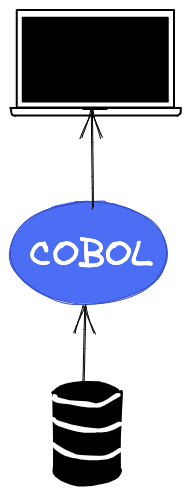
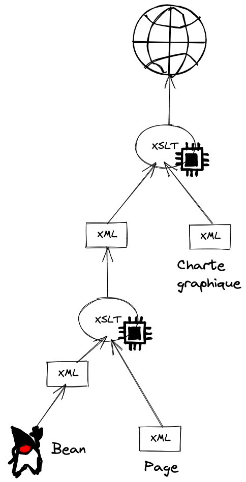
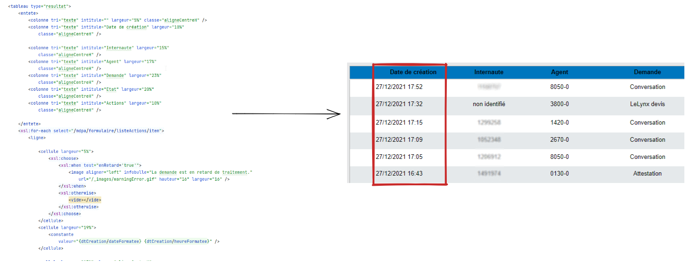
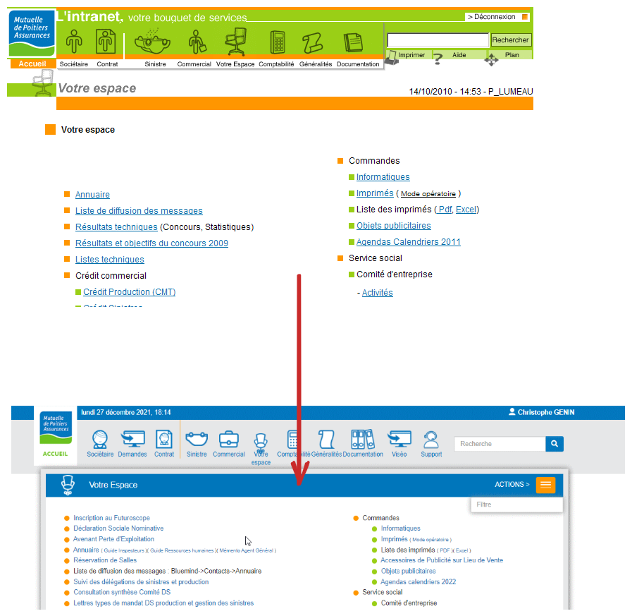
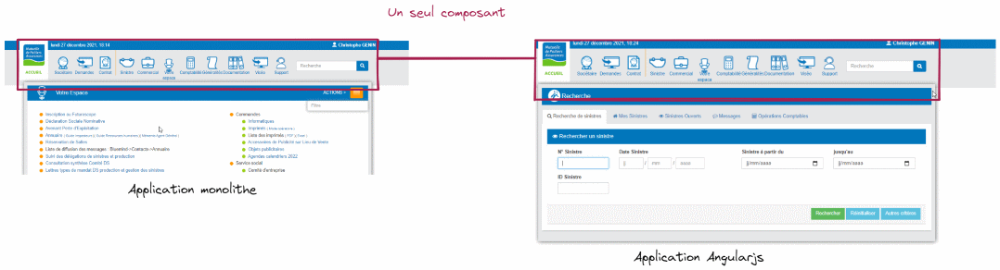
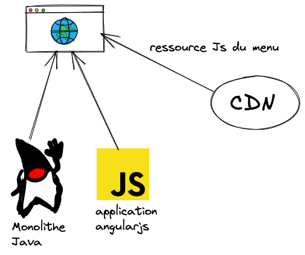
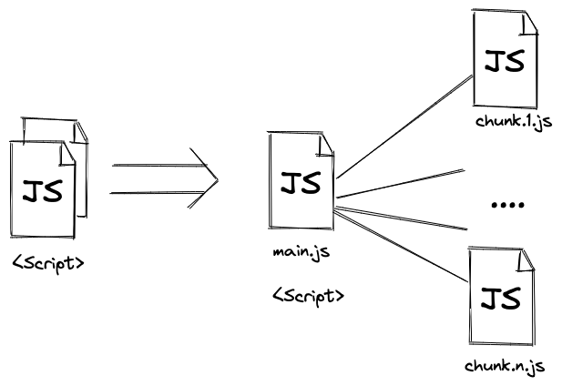
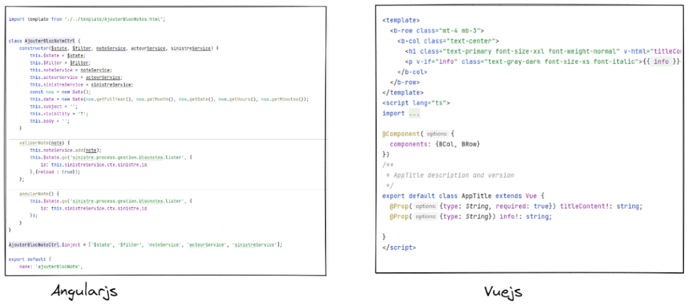
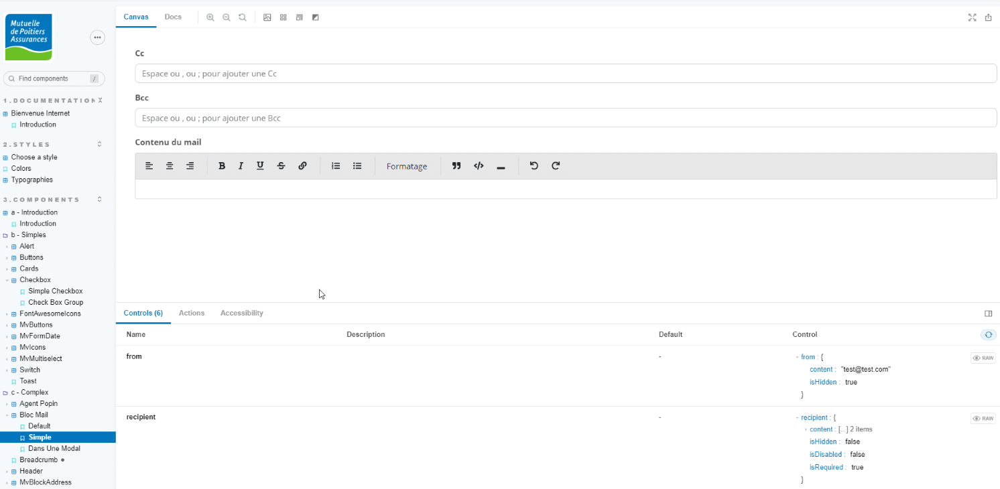

# L'évolution de nos IHMs sur 20 ans

<!-- Un retour d'expérience sur les évolutions et comment nous avons pu les adresser dans une DSI à taille humaine.  -->
---


# Qui je suis ?

## Christophe Genin
- Référent technique et fonctionnel à la mutuelle de poitiers assurance.
- Vieux dev fullstack ^^
- twitter : [@skarboune]()
---

### Et au début était
## COBOL 

Par contre comment faire interragir les utilisateurs ?

**Création d'une application desktop via powerbuilder**
<!-- Année 90 : mise en place des premières applications basées sur des traitements COBOL comme dans toutes les sociétés du milieu bancaire ou assurantiel quoi ! -->
<!--  l'interface basé sur powerbuilder : langage  orienté objet tournant sous windows -->

---
## Année 2000 


La révolution du web

---

## Monolithe Java

Basé sur Struts. 

Mais IHM basé sur **XSLT**    

<!-- XSLT est un langage de transformation XML de type fonctionnel. Exemple : il permet de transformer du XML en autres choses-->
- Page web définit par un fichier XML.
- Une charte graphique qui transforme le XML en HTML. 



---




---

## Bilan de cette première étape

- :smile: Librairie graphique basée sur des composants :arrow_right: :rocket:
- :frowning: Pas d'interaction possible avec le Html.
- :frowning: Langage non intuitif et difficile d'accès.

Mais surtout :

**Librairie mal construite : un composant peut générer plusieurs éléments différents**
<!-- Un seul composant pour générer tous les types de champs de formulaire possibles   -->
<!-- Maintenance complexe pouvant entrainer des effets de bords lors des modifications/ évolutions.   -->

```
Un composant doit avoir une granularité fine et être pur.
```
<!-- Exemple : les outils gnu ont une seul responsabilité. -->
---

## 
<!-- Lancement vers 2009 d'un gros projet (gestion des contrats santé) avec -->

Framework basé sur flash et possédant une intégration avec Spring.

- :frowning: Framework avec des bugs
- :frowning: Temps de développement assez long des ihms.
- :frowning: Projet POC important en temps de développement.

```
    Tester vos nouvelles briques sur des micro projets 
    non essentiel à votre business.
```

<!-- Exemple : les petits outils interne à la DSI, l'application cantine, etc...  -->

---

## Le changement de charte graphique


Effet de bord : Les utilisateurs pensent que ce sont de nouvelles applications **et Trouvent des bugs imaginaires**.
<!-- Le plus souvent des fonctionnalités qui n'existent pas. -->

```
En cas de gros changements graphiques, 
prévenez vos équipes support !!
```
---

## Architecture **Micro services**
<!-- Vers 2014/2015 -->
Décision de mettre en place une architecture micro services et de créer vers des ihms créés en JS.


Pour rappel, l'ancètre de Angular.


### Mais, comment valider cette brique ?

---

## Le composant menu

_Pré-requis_ : Avoir nos futures applications ayant le même rendu que celle du monolithe.

**:bulb:  Remplacer le menu du monolithe par un composant javascript.** 



---


## Fail : les mise à jour du menu.

Première version : inclusion du code Js dans chacun des projets. 

:arrow_right: Maintenance difficiles.

**:bulb: Définir un cdn interne.** 



---

## Pas de centre de gestion.


Utilisateur n'ayant pas forcément un réseau fibre...

```
Solution : Cacher vos fichiers de ressources via http.
```
<!-- Le protocole Http est très riche et possède des headers permettant de gérer le cache -->
<!-- Ajouter du hash sur vos fichiers Js. -->
<!-- Ajouter les headers de cache sur vos fichiers Js pour les mettre en cache du coté navigateur.  -->
<!-- Surtout n'oubliez pas de désactiver le cache sur votre navigateur.  -->

---

## D'autres amélioration

- Le code splitting
<!-- chargement dynamique de nos ressources JS suivant l'appel des routes de nos applications -->


- Et d'autres évolutions ....
<!-- Exemple : Es6 ou bien typescript, test unitaires, etc ....  -->
```
Toujours se garder 
informer des nouveautés
```
<!-- framework, méthodologie, librairie. Même si votre ancien framework ne les implémente pas par défaut, vous aurez peut être besoin de les mettre en place pour améliorer vos applications.  -->


---

## Vers un nouveau framework ? 

 
 
 

Décision de la DSI : Utiliser les mêmes technologies dans la partie internet.

**Et là, Angularjs ne fait plus le job.**

---
 
Les développeurs sont satisfaits d'angularjs pour les applications internes. => :trophy: VueJs est le gagnant.



<!-- React et Angular apportent pleins de changements.   -->
<!-- Performance similaire entre react et vuejs -->
<!-- Communauté moindre du coté vuejs mais vivantes. -->
<!-- Ce qui a fait pencher la balance est surtout le fait que le code est très similaire à angularjs. -->

<!-- TODO comparaison de code entre vue et angularjs  -->

---

## Bibliothèque de composants

Utiliser Storybook




---

## Ne pas oublier le passé

### Architecture Decision Record : ADR

Effectuez des comptes rendu de vos décisions d'architecture même celles impactant vos IHMs.

Utilisez vos wikis, vos issues, vos outils  de documentations projets pour noter vos essais, vos échecs, etc...

Et surtout faîtes qu'elles soient accessibles à tous vos développeurs.


---

## En conclusion

- L'utilisation de composants permet de créer des applications de gestion complexe rapidement. 
- Testez vos nouvelles briques sur des périmètres restreints (N'oubliez pas votre support et vos ops).
- Attention les nombres d'incidents augmentent en cas de gros changements graphiques.
- Ayez une bonne connaissance des bases (Protocole Http).
- Restez en veille (Sinon vous êtes venu pour la soirée vin rouge fromage ?).


--- 
- Collaborez et écoutez les remarques de toutes les personnes de vos DSI (Prestas inclus).
- Notez vos décisions, vos succés et vos échecs.
## Merci de m'avoir écouté

